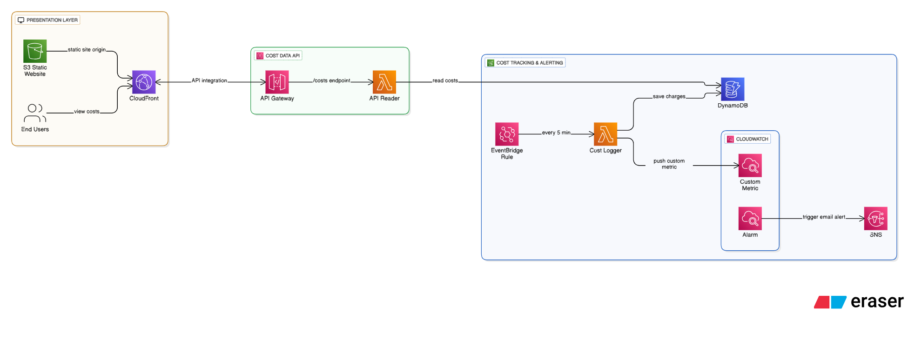

# Cloud Cost Tracker & Alert System

A serverless cloud project built with **Terraform**, **AWS Lambda**, **API Gateway**, **DynamoDB**, **SNS**, **CloudWatch**, and **CloudFront**.
The system tracks AWS costs, stores them in DynamoDB, exposes them via API, displays them on a dashboard, and sends email alerts when costs exceed a threshold.

---

## 📝 Table of Contents

* [Architecture](#architecture)
* [Milestones](#milestones)

  * [Milestone 1: IAM Setup & Terraform Init](#milestone-1-iam-setup--terraform-init)
  * [Milestone 2: Cost Logging Backend](#milestone-2-cost-logging-backend)
  * [Milestone 3: API Gateway + Reader Lambda](#milestone-3-api-gateway--reader-lambda)
  * [Milestone 4: Alerts (SNS + CloudWatch Alarm)](#milestone-4-alerts-sns--cloudwatch-alarm)
  * [Milestone 5: Frontend Dashboard](#milestone-5-frontend-dashboard)
  * [Milestone 6: Final Tweak (Cost Explorer Metric)](#milestone-6-final-tweak-cost-explorer-metric)
* [Screenshots](#screenshots)
* [Security Best Practices](#security-best-practices)
* [How to Run](#how-to-run)
* [Future Improvements](#future-improvements)

---

## 🏗 Architecture



---

## 🚀 Milestones

### Milestone 1: IAM Setup & Terraform Init

* Created an IAM user `terraform-user` with AdministratorAccess and access keys.
* Configured AWS CLI (`aws configure`).
* Verified identity with `aws sts get-caller-identity`.
* Initialized Terraform project with AWS provider.

📸 **Screenshots**

* `IAM-user.png` — IAM console with new user
* `aws-configure.png` — CLI identity output
* `terraform-init.png` — Terraform init success
* `empty-repo.png` — GitHub initialization
* `first-commit.png` — GitHub commit

---

### Milestone 2: Cost Logging Backend

* DynamoDB table `cost-tracker-logs` created.
* Lambda `cost-logger` created to fetch cost data and log into DynamoDB.
* EventBridge schedule set to `rate(5 minutes)` to invoke logger.

📸 **Screenshots**

* `dynamodb.png` — DynamoDB console
* `terraform-apply.png` — Terraform apply success
* `lambda-function.png` — Lambda console
* `dynamodb-scan.png` — DynamoDB scan output

---

### Milestone 3: API Gateway + Reader Lambda

* Lambda `cost-api-reader` created to scan DynamoDB.
* API Gateway HTTP API created with `/costs` route.
* Enabled CORS for frontend access.

📸 **Screenshots**

* `api-gateway-console.png` — API Gateway console with `/costs`
* `cost-api-reader.png` — API reader Lambda
* `curl-api-costs.png` — Terminal showing JSON from `/costs`

---

### Milestone 4: Alerts (SNS + CloudWatch Alarm)

* SNS topic `cost-alerts` created with email subscription.
* CloudWatch alarm `EstimatedChargesAlarm` created on AWS Billing metric.
* Email notifications enabled.

📸 **Screenshots**

* `sns-subscription.png` — Email subscription confirmation
* `sns-topic.png` — SNS topic in console
* `cloudwatch-alarm.png` — Alarm details

---

### Milestone 5: Frontend Dashboard

* S3 bucket + CloudFront distribution created.
* `index.html` uploaded and served via CloudFront.
* Dashboard fetches `/costs` API and displays data in a table.

📸 **Screenshots**

* `s3-bucket.png` — S3 bucket console
* `cloudfront.png` — CloudFront distribution console
* `dashboard-browser.png` — Browser showing dashboard

---

### Milestone 6: Final Tweak (Cost Explorer Metric)

* Updated `cost-logger` Lambda to use **Cost Explorer (ce:GetCostAndUsage)**.
* Published to custom metric `Custom/CostTracker/EstimatedCost`.
* Created alarm `CustomCostAlarm` (threshold: $0.10) with SNS alerts.
* Alarm evaluates every 5 minutes for demo purposes.

📸 **Screenshots**

* `custom-cost-alarm.png` — Alarm details
* `frontend-output.png` — Dashboard with rows

---

## 📸 Screenshots

All screenshots are stored in `/screenshots` and referenced in milestones.

---

## 🔒 Security Best Practices

For simplicity, this project used **IAM user + access keys**.
In real-world deployments, prefer:

* **AWS SSO / IAM Identity Center** (`aws configure sso`)
* **AssumeRole with IAM role** (`assume_role` block in provider)
* **EC2 Instance Roles** or **CloudShell** (automatic credentials)

Example Terraform snippet for role assumption:

```hcl
provider "aws" {
  region = "us-east-1"
  assume_role {
    role_arn = "arn:aws:iam::<account-id>:role/TerraformExecutionRole"
  }
}
```

---

## ▶️ How to Run

1. Clone repo:

   ```bash
   git clone https://github.com/<your-username>/cloud-cost-tracker.git
   cd cloud-cost-tracker/terraform
   ```
2. Initialize:

   ```bash
   terraform init
   ```
3. Apply:

   ```bash
   terraform apply -var="alert_email=you@example.com"
   ```
4. Confirm SNS subscription via email.
5. Open CloudFront URL for dashboard.

